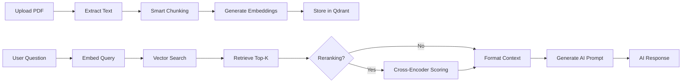

# 🔍 RAG Project — Intelligent Document Q&A System

[](https://www.python.org/downloads/)
[](https://flask.palletsprojects.com/)
[](https://qdrant.tech/)

A production-ready **Retrieval-Augmented Generation (RAG)** system that transforms your documents into an intelligent knowledge base. Upload PDFs, ask questions, and get accurate answers backed by semantic search and AI-powered generation.

## ✨ Key Features

- 📚 **Smart Document Ingestion**: Automatically extract and chunk PDFs with semantic-aware splitting
- 🧠 **Advanced Embedding**: Generate 384-dimensional vector embeddings using state-of-the-art models
- 🚀 **High-Performance Vector Search**: Lightning-fast similarity search powered by Qdrant
- 🎯 **Intelligent Reranking**: Cross-encoder reranking for superior result relevance
- 🌐 **Modern Web Interface**: Beautiful, responsive Flask-based UI with real-time progress tracking
- 🔄 **Flexible Integration**: Easy-to-integrate with any AI model (OpenAI, Anthropic, local LLMs)
- 📊 **Visual Logging**: Color-coded, timestamped logs for full operation transparency
- 🐳 **Docker-Ready**: One-command deployment with containerized Qdrant

---

## 📁 Project Structure

```
rag-project/
├── src/
│   ├── app.py                # Flask web server with REST API and WebSocket support
│   ├── ingest.py             # PDF extraction, chunking, embedding generation
│   ├── query.py              # Vector search, reranking, and prompt generation
│   ├── embedding_config.py   # Embedding model configuration
│   └── templates/
│       └── index.html        # Modern single-page web interface
├── scripts/
│   ├── start.sh                 # 🚀 One-command full system initialization
│   ├── stop.sh                  # 🛑 Gracefully shutdown all services
│   ├── run_web.sh               # Launch Flask web interface
│   ├── install_dependencies.sh  # Setup Python environment
│   ├── start_qdrant.sh          # Start Qdrant Docker container
│   ├── run_ingest.sh            # CLI document ingestion
│   └── run_query.sh             # CLI interactive Q&A session
├── tests/
│   └── test_rag.py          # Comprehensive unit and integration tests
├── requirements.txt          # Python dependencies
└── README.md
```

---

## 🔄 How It Works



**The RAG Pipeline:**

1. **Ingestion Phase**:
   - Extract text from PDF documents
   - Split into semantic chunks (configurable size)
   - Generate vector embeddings using sentence transformers
   - Store in Qdrant vector database with metadata

2. **Query Phase**:
   - Convert user question to vector embedding
   - Perform similarity search in Qdrant
   - Optionally rerank results using cross-encoder
   - Build context-rich prompt for AI model
   - Generate accurate, contextual answer

---

## 📋 Prerequisites

Before you begin, ensure you have:

- **Python 3.8+** ([Download](https://www.python.org/downloads/))
- **Docker** ([Install Docker](https://docs.docker.com/get-docker/))
- **Git** (for cloning the repository)
- **4GB+ RAM** (recommended for embedding generation)

---

## 🚀 Quick Start

Get up and running in under 2 minutes:

```bash
# Clone the repository
git clone <your-repo-url>
cd rag-project

# Initialize everything: venv, dependencies, Qdrant, tests, and web interface
bash scripts/start.sh
```

**That's it!** The system will:

1. ✅ Create and activate Python virtual environment
2. ✅ Install all required dependencies
3. ✅ Start Qdrant vector database in Docker
4. ✅ Run comprehensive test suite
5. ✅ Launch Flask web interface

**Access Points:**

- 🌐 **Web Interface**: [http://localhost:5000](http://localhost:5000)
- 📊 **Qdrant Dashboard**: [http://localhost:6333/dashboard](http://localhost:6333/dashboard)

**To stop all services:**

```bash
bash scripts/stop.sh
```

---

## Manual Installation

```bash
# 1. Install Python dependencies
bash scripts/install_dependencies.sh

# 2. Start the Qdrant vector database
bash scripts/start_qdrant.sh
```

---

## 📖 Usage Guide

### 🌐 Web Interface (Recommended)

The easiest way to interact with the system:

```bash
# Full initialization (includes Qdrant startup)
bash scripts/start.sh

# Or just launch the web interface (Qdrant must be running)
bash scripts/run_web.sh

# With custom port
bash scripts/run_web.sh 8080
```

**Features:**

- 📤 **Drag & Drop Upload**: Intuitive PDF upload with real-time progress
- 🎛️ **Advanced Options**: Configure collection name, chunk size, and chunking mode
- 🔍 **Smart Search**: Semantic search with adjustable Top-K and reranking
- 📊 **Visual Feedback**: Color-coded logs with timestamps for every operation

### 📄 Document Ingestion

**Basic ingestion:**

```bash
bash scripts/run_ingest.sh path/to/document.pdf
```

**Advanced usage with parameters:**

```bash
# Syntax: run_ingest.sh <pdf_path> [collection_name] [chunk_size]
bash scripts/run_ingest.sh research_paper.pdf research_docs 500

# Examples:
bash scripts/run_ingest.sh books/physics.pdf physics_collection 300
bash scripts/run_ingest.sh manual.pdf user_manuals 1000
```

**What happens during ingestion:**

- ✅ Text extraction from PDF
- ✅ Smart chunking (semantic or fixed-size)
- ✅ Embedding generation (384 dimensions)
- ✅ Vector storage in Qdrant
- ✅ Metadata indexing

### 💬 Interactive Q&A (Command Line)

**Basic query mode:**

```bash
bash scripts/run_query.sh
# Default: uses 'documents' collection, Top-K=5, no reranking
```

**Advanced query with parameters:**

```bash
# Syntax: run_query.sh [collection_name] [top_k] [reranking]
bash scripts/run_query.sh my_collection 10 true

# Examples:
bash scripts/run_query.sh physics_collection 3 false
bash scripts/run_query.sh research_docs 7 true
```

**Reranking Explained:**

Enabling reranking uses a **cross-encoder model** to re-score retrieved chunks, dramatically improving relevance:

| Without Reranking        | With Reranking                      |
| ------------------------ | ----------------------------------- |
| Fast but less accurate   | Slightly slower, much more accurate |
| Direct vector similarity | Two-stage: retrieve → rerank        |
| Good for broad queries   | Excellent for complex questions     |

**Dynamic Retrieval Strategy:**

- **Top-K ≤ 17**: Retrieves 20 candidates for optimal reranking
- **Top-K > 17**: Retrieves 120% of Top-K to ensure quality

📄 **Details**: See [TOPK_BUG_FIX.md](TOPK_BUG_FIX.md) for the complete reranking algorithm.

---

## Progress Logging

The system provides **real-time visual feedback** during operations:

### Web Interface

- **Progress Modal**: Animated overlay shows detailed step-by-step logs
- **Timestamps**: Each operation logged with precise timing
- **Color-Coded**: Info (blue), Processing (yellow), Success (green), Error (red)
- **Auto-Dismiss**: Modal automatically closes after completion

**Upload Process Logs:**

```
📄 File: example.pdf (2.5 MB)
📦 Collection: documents
⚙️ Chunk mode: semantic
🔄 Uploading file...
✓ File uploaded
✓ Created 45 chunks
✓ Generated embeddings (384 dimensions)
⏱️ Completed in 3.2s
```

**Search Process Logs:**

```
❓ Question: Who is Khalil?
🔢 Top-K: 5
🎯 Reranking: Enabled
✓ Retrieved 20 initial results
✓ Reranked to top-5 most relevant chunks
⏱️ Completed in 0.54s
```

### Backend Console

Detailed logs appear in the Flask terminal:

```
[UPLOAD] Starting document ingestion
[UPLOAD] ✓ Extracted 15234 characters
[UPLOAD] ✓ Created 45 chunks
[UPLOAD] ✓ Generated 45 embedding vectors
[UPLOAD] ✅ Ingestion completed successfully!
```

See [PROGRESS_LOGGING.md](PROGRESS_LOGGING.md) for complete documentation.

---

## 🤖 AI Model Integration

The system is designed to work with **any AI model**. Simply provide a function that takes a prompt and returns a response.

### OpenAI Integration

```python
# In src/query.py
import openai
from openai import OpenAI

client = OpenAI(api_key="your-api-key")

def openai_model(prompt: str) -> str:
    """Generate response using OpenAI GPT-4."""
    response = client.chat.completions.create(
        model="gpt-4o",
        messages=[{"role": "user", "content": prompt}],
        temperature=0.7,
        max_tokens=1000
    )
    return response.choices[0].message.content
```

### Anthropic Claude Integration

```python
import anthropic

client = anthropic.Anthropic(api_key="your-api-key")

def claude_model(prompt: str) -> str:
    """Generate response using Claude."""
    response = client.messages.create(
        model="claude-3-5-sonnet-20241022",
        max_tokens=1024,
        messages=[{"role": "user", "content": prompt}]
    )
    return response.content[0].text
```

### Local LLM (Ollama)

```python
import requests

def ollama_model(prompt: str) -> str:
    """Generate response using local Ollama model."""
    response = requests.post(
        "http://localhost:11434/api/generate",
        json={
            "model": "llama2",
            "prompt": prompt,
            "stream": False
        }
    )
    return response.json()["response"]
```

### Using Your Custom Model

```python
# Pass your model function to query_loop
from src.query import query_loop

query_loop(
    collection_name="documents",
    top_k=5,
    ai_model_fn=your_custom_model  # Your function here
)
```

---

## 🧪 Testing

Run the comprehensive test suite to verify your installation:

```bash
# Run all tests with verbose output
python -m pytest tests/test_rag.py -v

# Run specific test
python -m pytest tests/test_rag.py::test_embed_text -v

# Run with coverage report
python -m pytest tests/test_rag.py --cov=src --cov-report=html
```

**What's tested:**

- ✅ Embedding generation and dimension validation
- ✅ PDF text extraction
- ✅ Text chunking algorithms
- ✅ Qdrant connection and operations
- ✅ Vector search accuracy
- ✅ Reranking functionality
- ✅ End-to-end RAG pipeline

---

## ✅ Quality Checklist

Before using the system in production, verify:

- [ ] ✅ Qdrant is running (`docker ps | grep qdrant`)
- [ ] ✅ Dependencies installed (`pip list | grep -E "sentence-transformers|qdrant-client"`)
- [ ] ✅ Virtual environment activated (`which python` shows venv path)
- [ ] ✅ PDF ingested without errors (check logs)
- [ ] ✅ Embeddings have correct dimensions (384 for default model)
- [ ] ✅ Vector search returns relevant chunks (test with sample queries)
- [ ] ✅ Prompt formatting includes both context and question
- [ ] ✅ AI model configured and responding correctly
- [ ] ✅ All unit tests passing (`pytest tests/`)
- [ ] ✅ Web interface accessible on http://localhost:5000

---

## ⚙️ Configuration

### Environment Variables

Create a `.env` file in the project root:

```bash
# Qdrant Configuration
QDRANT_HOST=localhost
QDRANT_PORT=6333

# Flask Configuration
FLASK_PORT=5000
FLASK_DEBUG=False

# Embedding Model
EMBEDDING_MODEL=all-MiniLM-L6-v2
EMBEDDING_DIMENSION=384

# Reranking Model
RERANK_MODEL=cross-encoder/ms-marco-MiniLM-L-6-v2

# Default Parameters
DEFAULT_CHUNK_SIZE=500
DEFAULT_TOP_K=5
DEFAULT_COLLECTION=documents
```

### Embedding Model Options

You can change the embedding model in `src/embedding_config.py`:

| Model                        | Dimensions | Speed  | Quality    | Use Case          |
| ---------------------------- | ---------- | ------ | ---------- | ----------------- |
| `all-MiniLM-L6-v2`           | 384        | ⚡⚡⚡ | ⭐⭐⭐     | Default, balanced |
| `all-mpnet-base-v2`          | 768        | ⚡⚡   | ⭐⭐⭐⭐   | Higher quality    |
| `all-MiniLM-L12-v2`          | 384        | ⚡⚡   | ⭐⭐⭐⭐   | Better accuracy   |
| `multi-qa-mpnet-base-dot-v1` | 768        | ⚡⚡   | ⭐⭐⭐⭐⭐ | QA optimized      |

---

## 🚀 Performance Tips

### Optimize Chunking

- **Smaller chunks (200-300)**: Better for precise answers, more vectors
- **Larger chunks (800-1000)**: Better for context, fewer vectors
- **Semantic chunking**: Best for maintaining context (default)

### Optimize Search

- **Top-K = 3-5**: Fast, good for focused questions
- **Top-K = 10-15**: More context, better for complex questions
- **Enable reranking**: +20-40% accuracy, slightly slower

### Optimize Ingestion

- Process PDFs in parallel (modify `ingest.py`)
- Use batch embedding (already implemented)
- Adjust `batch_size` for your RAM

### Docker Performance

```bash
# Increase Qdrant memory limit
docker run -d --name qdrant \
  -p 6333:6333 \
  -p 6334:6334 \
  --memory="4g" \
  --cpus="2" \
  -v $(pwd)/qdrant_storage:/qdrant/storage \
  qdrant/qdrant
```

---

## 🐛 Troubleshooting

### Qdrant Connection Issues

**Problem**: `ConnectionError: Cannot connect to Qdrant`

**Solutions**:

```bash
# Check if Qdrant is running
docker ps | grep qdrant

# Restart Qdrant
docker restart qdrant

# Check Qdrant logs
docker logs qdrant

# Verify port availability
lsof -i :6333
```

### Embedding Generation Errors

**Problem**: `RuntimeError: CUDA out of memory`

**Solutions**:

```python
# Force CPU usage (slower but works with less RAM)
# In embedding_config.py
device = 'cpu'

# Or reduce batch size
batch_size = 8  # Default is 32
```

### PDF Extraction Issues

**Problem**: `Cannot extract text from PDF`

**Solutions**:

```bash
# Install additional dependencies
pip install pdfplumber pypdf2

# Try different extraction methods
# Some PDFs are scanned images - use OCR:
pip install pytesseract pillow
```

### Import Errors

**Problem**: `ModuleNotFoundError`

**Solutions**:

```bash
# Ensure virtual environment is activated
source .venv/bin/activate  # Linux/Mac
.venv\Scripts\activate     # Windows

# Reinstall dependencies
pip install -r requirements.txt --force-reinstall
```

### Web Interface Not Loading

**Problem**: Browser shows "Connection refused"

**Solutions**:

```bash
# Check if Flask is running
ps aux | grep flask

# Check port availability
netstat -an | grep 5000

# Try different port
bash scripts/run_web.sh 8080
```

---

## 📚 Additional Documentation

- [PROGRESS_LOGGING.md](PROGRESS_LOGGING.md) - Complete logging system documentation
- [TOPK_BUG_FIX.md](TOPK_BUG_FIX.md) - Reranking algorithm and dynamic retrieval
- [IMPROVEMENTS.md](IMPROVEMENTS.md) - Change log and feature roadmap

---

## 🤝 Contributing

Contributions are welcome! Here's how you can help:

1. **Fork the repository**
2. **Create a feature branch**: `git checkout -b feature/amazing-feature`
3. **Make your changes** and add tests
4. **Run tests**: `pytest tests/ -v`
5. **Commit**: `git commit -m 'Add amazing feature'`
6. **Push**: `git push origin feature/amazing-feature`
7. **Open a Pull Request**

### Development Setup

```bash
# Clone your fork
git clone https://github.com/your-username/rag-project.git
cd rag-project

# Install development dependencies
pip install -r requirements.txt
pip install -r requirements-dev.txt  # If available

# Run tests before making changes
pytest tests/ -v
```

---

## 📄 License

This project is licensed under the MIT License - see the LICENSE file for details.

---

## 🙏 Acknowledgments

- **Qdrant**: High-performance vector database
- **Sentence Transformers**: Excellent embedding models
- **Flask**: Web framework
- **PyPDF2**: PDF processing
- **pytest**: Testing framework

---

## 📞 Support

Having issues? Check:

- 📖 [Documentation](#-additional-documentation)
- 🐛 [Troubleshooting](#-troubleshooting)
- 💬 [GitHub Issues](https://github.com/your-username/rag-project/issues)

---

**Built with ❤️ for the AI community**
